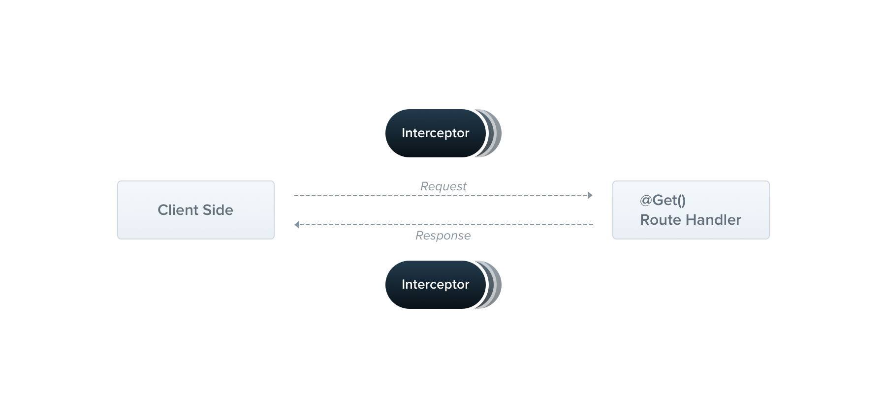

# Interceptors

An **interceptor** is an `@Injectable()` class which implements the `NestInterceptor` interface.



Interceptors may:

- Bind extra logic before and/or after method execution.
- Transform result.
- Transform exception thrown from function.
- Extend basic function behaviour.
- Override function depending on conditions (e.g. caching).

## Basics

Each interceptor implements `intercept()` method, which takes two arguments:

- `ExecutionContext`
- `CallHandler`

### Call Handler

The `CallHandler` implements `handle()` which can be used to invoke the route handler from the interceptor - not calling `handle()` prevents the handler from being executed.

The `intercept()` method *wraps* the request/response stream (a **pointcut**).

## Aspect Interception

```typescript
import { Injectable, NestInterceptor, ExecutionContext, CallHandler } from '@nestjs/common';
import { Observable } from 'rxjs';
import { tap } from 'rxjs/operators';

@Injectable()
export class LoggingInterceptor implements NestInterceptor {
  intercept(context: ExecutionContext, next: CallHandler): Observable<any> {
    console.log('Before...');

    const now = Date.now();
    return next
      .handle()
      .pipe(
        tap(() => console.log(`After... ${Date.now() - now}ms`)),
      );
  }
}
```

## Binding Interceptors

Use `@UseInterceptors()` decorator.

```typescript
@UseInterceptors(LoggingInterceptor)
export class CatsController {}
```

## Response Mapping

Wraps a `T` value into a `Response<T>` value, e.g. wraps the response under a new object with `data` property.

```typescript
import { Injectable, NestInterceptor, ExecutionContext, CallHandler } from '@nestjs/common';
import { Observable } from 'rxjs';
import { map } from 'rxjs/operators';

export interface Response<T> {
  data: T;
}

@Injectable()
export class TransformInterceptor<T> implements NestInterceptor<T, Response<T>> {
  intercept(context: ExecutionContext, next: CallHandler): Observable<Response<T>> {
    return next.handle().pipe(map(data => ({ data })));
  }
}
```

`null` to `‘’` transformation:

```typescript
import { Injectable, NestInterceptor, ExecutionContext, CallHandler } from '@nestjs/common';
import { Observable } from 'rxjs';
import { map } from 'rxjs/operators';

@Injectable()
export class ExcludeNullInterceptor implements NestInterceptor {
  intercept(context: ExecutionContext, next: CallHandler): Observable<any> {
    return next
      .handle()
      .pipe(map(value => value === null ? '' : value ));
  }
}
```

## Exception Mapping

```typescript
import {
  Injectable,
  NestInterceptor,
  ExecutionContext,
  BadGatewayException,
  CallHandler,
} from '@nestjs/common';
import { Observable, throwError } from 'rxjs';
import { catchError } from 'rxjs/operators';

@Injectable()
export class ErrorsInterceptor implements NestInterceptor {
  intercept(context: ExecutionContext, next: CallHandler): Observable<any> {
    return next
      .handle()
      .pipe(
        catchError(err => throwError(new BadGatewayException())),
      );
  }
}
```

## Stream Overriding

For example, a **cache interceptor**:

```typescript
import { Injectable, NestInterceptor, ExecutionContext, CallHandler } from '@nestjs/common';
import { Observable, of } from 'rxjs';

@Injectable()
export class CacheInterceptor implements NestInterceptor {
  intercept(context: ExecutionContext, next: CallHandler): Observable<any> {
    const isCached = true;
    if (isCached) {
      return of([]);
    }
    return next.handle();
  }
}
```

## More Operators

Handling *timeouts*:

```typescript
import { Injectable, NestInterceptor, ExecutionContext, CallHandler } from '@nestjs/common';
import { Observable } from 'rxjs';
import { timeout } from 'rxjs/operators';

@Injectable()
export class TimeoutInterceptor implements NestInterceptor {
  intercept(context: ExecutionContext, next: CallHandler): Observable<any> {
    return next.handle().pipe(timeout(5000))
  }
}
```

